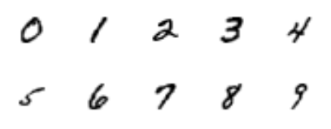
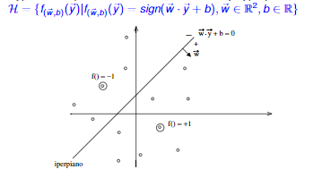

# Introduction to Machine Learining Basics

## Introduction

* __When__ and __Why__ to use Machine Learning
* paradigms
* fundamental Ingredients
* statistical Learning Theory

## When

__When__ the considered system should

* __adapt__ to the surrounding environment
* __improve__ its performance with respect to a specific computational task
* __discover__ regularities and new information from empirical data
* __acquire__ new computational capabilities

## Why

__Why__ not to use traditional algorithmic approach

* impossible to exactly formalize the problem solved
* presence of noise and/or uncertainty
* high complexity in formulating a solution
* lack of compiled knowledge with respect to the problem to be solved

## Data

### Tipically

* data is available
  * obtained once for all
  * acquired incrementally by interacting with the environment
* knowledge of the application domain is available, however
  * incomplete
  * imprecise

### Desiderata

to use data for

* acquiring new knowledge
* refining the already available knowledge
* correcting the already available knowledge

### Example - Handwritten Digit Recognition

* impossible to exactly formalize the problem (only examples are available)
* noise may be present and data may present ambiguities

## Lines of Research within Machine Learning

* Induction of Rules/Decision Trees from data
* Neural Networks
* Instance Based Learning
* Probabilistic (Bayesian) learning
* Reinforcement learning
* Genetic Algorithms
* Inductive Logic Programming

## Main Learning Paradigms

### Supervised Learning

* given pre-classified examples learn a general description which captures the information content of the examples
* it should be possible to use this description in a predictive way
* it is assumed that an expert provides the supervision

### Unsupervised Learning

* given a set of examples discover regularities and/or patterns
* there si no expert to help us

### Reinforced Learning

* __agent__ which may
  * be in _state s_, and
  * execute an _action a_
* and operates in an _environment e_, which in response to action _a_ in state _s_ returns
  * the _next state_, and
  * a _reward r_, which can be _positive_, _negative_ or _neutral_

The goal of the agent is to maximize a function of the rewards

## Fundamental Ingredients

* __Training Data__ (Drawn from the __Instance Space X__)
* __Hypotesis Space, H__
  * it constitutes the set of functions which can be implemented by the machine learning system
  * it is assumed that the function to be learned _f_ may be represented by a hypothesis _h in H_
  * or that at least a hypothesis _h in H_ is "similar" to _f_
* Search Algorithm into the Hypothesis Space, __Learning Algorithm__

__WARNING:__ _H_ cannot coincide with the set of all possible functions and the search to be exhaustive

__[Inductive Bias](https://en.wikipedia.org/wiki/Inductive_bias):__ The group of assumptions used on the representation and/or the search

## Example of hypothesis space

Hyperplanes in R^2

* Instance Space -> points into the plane
* Hypothesis Space -> dichotomies induced by hyperplanes in R^2

