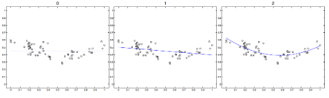

# Introduction to Machine Learining Basics

## Introduction

* __When__ and __Why__ to use Machine Learning
* paradigms
* fundamental Ingredients
* statistical Learning Theory

## When

__When__ the considered system should

* __adapt__ to the surrounding environment
* __improve__ its performance with respect to a specific computational task
* __discover__ regularities and new information from empirical data
* __acquire__ new computational capabilities

## Why

__Why__ not to use traditional algorithmic approach

* impossible to exactly formalize the problem solved
* presence of noise and/or uncertainty
* high complexity in formulating a solution
* lack of compiled knowledge with respect to the problem to be solved

## Data

### Tipically

* data is available
  * obtained once for all
  * acquired incrementally by interacting with the environment
* knowledge of the application domain is available, however
  * incomplete
  * imprecise

### Desiderata

to use data for

* acquiring new knowledge
* refining the already available knowledge
* correcting the already available knowledge

### Example - Handwritten Digit Recognition

* impossible to exactly formalize the problem (only examples are available)
* noise may be present and data may present ambiguities

## Lines of Research within Machine Learning

* Induction of Rules/Decision Trees from data
* Neural Networks
* Instance Based Learning
* Probabilistic (Bayesian) learning
* Reinforcement learning
* Genetic Algorithms
* Inductive Logic Programming

## Main Learning Paradigms

### Supervised Learning

* given pre-classified examples learn a general description which captures the information content of the examples
* it should be possible to use this description in a predictive way
* it is assumed that an expert provides the supervision

### Unsupervised Learning

* given a set of examples discover regularities and/or patterns
* there si no expert to help us

### Reinforced Learning

* __agent__ which may
  * be in _state s_, and
  * execute an _action a_
* and operates in an _environment e_, which in response to action _a_ in state _s_ returns
  * the _next state_, and
  * a _reward r_, which can be _positive_, _negative_ or _neutral_

The goal of the agent is to maximize a function of the rewards

## Fundamental Ingredients

* __Training Data__ (Drawn from the __Instance Space X__)
* __Hypotesis Space, H__
  * it constitutes the set of functions which can be implemented by the machine learning system
  * it is assumed that the function to be learned _f_ may be represented by a hypothesis _h in H_
  * or that at least a hypothesis _h in H_ is "similar" to _f_
* Search Algorithm into the Hypothesis Space, __Learning Algorithm__

__WARNING:__ _H_ cannot coincide with the set of all possible functions and the search to be exhaustive

__[Inductive Bias](https://en.wikipedia.org/wiki/Inductive_bias):__ The group of assumptions used on the representation and/or the search

## Example of hypothesis space

Hyperplanes in R^2

* Instance Space -> points into the plane
* Hypothesis Space -> dichotomies induced by hyperplanes in R^2

## Example of Inductive Bias in Concept Learning

__Definition:__ A concept on an Instance Space __X__ is defined as a boolean function on _X_.

__Definition:__ An example of a concept _c_ on the Instance Space _X_ is defined as a couple _(x,c(x))_, where _x in X_ and _c()_ is a boolean function.

__Definition:__ Let _h_ be a boolean function defined in the Instance Space _X_. We say that _h_ satisfies _x in X_ if _h(x)=1_ (True).

__Definition:__ Let _h_ be a boolean function defined on the Instance Space _X_ and _(x,c(x))_ an example of _c()_. We say that _h_ is consistent  with the example if _h(x) = c(x)_. Moreover we say that _h_ is consistent with a set of examples _Tr_ if _h_ is consistent with every example in _Tr_.

## Hypothesis Space: conjunctions of literals

[Conjunction of _m_ literals](https://en.wikipedia.org/wiki/Conjunctive_normal_form)

* Instance Space -> strings of _m_ bits: _X = {s|s in {0,1}^m}_
* Hypotesis Space -> all the logic sentences involving literals and just containing the operator ∧:

  

Notice that if in a formula a literal occurs together with its negation, then the formula is always _false_. So, all the formulas containing a literal and its negation, are equivalent to _false_.

## Hypotesis Space of Boolean Functions

Conjunction of _m_ literals

How many distincts hypothesis there are as a function of _m_?

Considering that all the unsatisfiable formulas are equivalent to false, we do not consider formulas where a literal occurs together with its negation.
So, for each possible bit of the input string the corresponding literal may not be present in the logic formula or, if it appears, it is either asserted or negated:

3\*3\*3\*3...3 = 3^m

And considering the always false formula, we get 3^m + 1

## Hypotesis space: partial order

## Learning Conjunctions of Literals

__Find S__ Algorithm
/* it finds the most specific hypothesis which is consistent with the training set */

* input: training set _Tr_
* initiate _h_ to the most specific

  
* for each positive training instance (_x_, _true_) in _Tr_
  * remove from _h_ any literal which is not satisfied by _x_
* returns _h_

## Example of application: _m_=5

## Inductive Bias

## Hypothesis Space of Boolean Functions

Lookup Table

* Instance Space -> strings of _m_ bits: _X = {s|s in {0,1}^m}
* Hypothesis Space -> all the possible truth tables which map input instances to the _true_ and _false_: _H = {f(s)|f : X ->{true,false}}_

  

How many distinct hypothesis there are as a function of _m_?

By a lookup table it is possible to implement any boolean function on the Instance Space

Since the number of possible instances is:

2\*2\*2\*2...2 = 2^m

the number of distinct funtions is: 2^(2^m)

## Another Example of Learning Algorithm

### Training algorithm for a Perceptron

input: training set _Tr = {(x,t)}_, where _t in {-1,+1}_

1. inizialize the weight vector w to the null vector (all components equal to 0)
2. repeat
    1. select (at random) one training example _(x,t)_
    2. if _out = sign(w*x) != t_ then

        w<-w+(t-out)x

### Example of Execution

## Hypothesis Space Complexity

__Def:__ __Shattering__

Given S ⊂ X, S is shattered by the Hypothesis Space _H_ if and only if

(_A set of N points is shattered if there exists a hypothesis that is consistent with every classification of the N points_)

__Def:__ __VC-dimension__

The VC-dimension of a Hypothesis Space _H_ defined over an Instance Space _X_ is the size of the largest finite subset of _X_ shattered by _H_ (_the maximum number of data points that can be shattered_):

if arbitrarily large finite sets of _X_ can be shattered by _H_, then _VC(H) = inf_

### VC-dimension example

What is the VC-dimension for the Hyperplane dichotomies Hypothesis Space?

_VC(H)_ = 3

It is impossible to shatter 4 points

## Empirical Error

The __Empirical Error__ of hypothesis _h_ with respect to _Tr_ is the number of examples that _h_ misclassifies:

_h_ in _H_ __overfits__ _Tr_ if Exists _h'_ in _H_ such that error _Tr_ (_h_)< error _Tr_ (_h'_), but error _D_ (_h_) > error _D_ (_h'_)

## True Error

The __True Error__ of hypothesis _h_ with respect to the target concept _c_ and distribution _D_ is the probability that _h_ will misclassify an instance drawn at random according to _D_

## Why VC-dimension is useful: Confidence Intervals

Consider a binary classification problem. Given:

* Training Set: _Tr_
* Hypothesis Space: _H_
* Learning Algorithm: _L_ returning h\_w\*, where w\* minimizes the empirical error

It is possible to use VC-dimension to bound the true error, for example:

where

* __A__ only depends on the hypothesis returned by the learning algorithm
* __B__ is indipendent from the hypothesis returned by the learning algorithm, however it DEPENDS on the ratio between VC(_H_) and the number of training examples _n_, and from the confidence with which the bound holds

__B__ is usually called VC-confidence

## Structural Risk Minimization

Problem: as the VC-dimension grows, the empirical risk (A) decreases, however the VC confidence (B) increases

__Structural Risk Minimization__ aims to minimizing the right hand of the confidence bound, so to get a tradeoff between A and B

## Underfitting/Overfitting and learning parameters

* suppose we have some data (60 points) that we want to fit a curve to

  
* let fit a polynomial, of the form

  
* how to choose p? (Hypothesis Space)
* for various p, we can find and plot the best polynomial, in terms of minimizing the Empirical Error
* here are the solutions for different values of p

  
  
  
  
* here is a summary of the Empirical Error ... and the Empirical Error over some new TEST data (100.000 extra points) from the same distribution, as a function of p:

  
* for very low p, the model is very simple, and so cannot capture the full complexities of the data (Underfitting! also called __Bias__)
* for very high p, the model is complex, and so tends to overfit to spurious properties of the data (Overfitting! also called __Variance__)

Unfortunately we cannot use the test set to pick up the right value of p!

___Practical Problem:__ how can we use the training set to set p?_

## Model Selection and Hold-out

We can hold out some of our original training data

### Hold-out procedure

1. a small subset of _Tr_, called the validation set (or hold-out set), denoted _Va_, is identified
2. a classifier/regressor is learnt using examples in _Tr-Va_
3. step 2 is perfromed with different values of the parameter(s) (in our example p), and tested against the hold-out sample

In an operational setting, after parameter optimization, one typically re-trains the classifier on the entire training corpus, in order to boost effectiveness (debatable step!)

It is possible to shoe that the evaluation performed in step 2 gives an unbiased estimate of the errore performed by a classifier learnt with the same parameter(s) and with training set of cardinality |_Tr_|-|_Va_|<|_Tr_|

## K-fold Cross Validation

An alternative approach to model selection (and evaluation) is the K-fold cross-validation method

### K-fold CV procedure

1. k different classifiers/regressors h1,h2,...,hk are built by partitioning teh initial corpus _Tr_ into k disjoint sets _Va1_,...,_Vak_ and then iteratively applying the Hold-out approach on the k-pairs (_Tri_ = _Tr-Vai_,_Vai_)
2. final error is obtained by individually computing the errors of h1,...,hk and then averaging the individual results

The above procedure is repeated for different values of the parameter(s) and the setting (model) with smaller final error is selected

The special case k = |_Tr_| of k-fold cross-validation is called __leave-one-out__ cross-validation

## Back to our example

* let's apply 5-fold CV

  
* minimum error reached for p=3, rather than the optimal p = 12
* clearly, cross validation is no substitute for a large set. However, if we only have a limited training set, it is often the best option available

Why cross-validation selected a simpler model than optimal?

* notice that with 60 points, 5-fold cross validation effectively tries to pick the polynomial that makes the best bias-variance tradeoff for 48 (60 \*4/5) points
* with 10-fold cross validation, it would instead try to pick the best polynomial for 54 (60\*9/10) points

  Thus, cross validation is biased towards simpler models
* __leave-one-out__ cross-validation reduced this tendency to the minimum possible by doing 60-fold cross validation
* so let's try __leave-one-out__ cross-validation
* we still get p=3!
* Cross validation is a good technique, but it doesn't work miracles: there is only so much information in a small dataset.

### In general

Almost all learning algorithms have (hyper)parameters

* Support Vector Machines: C, type of kernel (polynomial,RBF, etc.), kernel parameter (degree of polynomial, width of RFB, etc.)
* Neural Networks:  nonlinear/linear neurons, number of hidden units, η, other learning parameters we have not discussed(e.g., momentum μ)

Hold-out or Cross-Validation can e used to select the "optimal" values for the (hyper)parameters

__After__ model selection, the test set is used to evaluate the goodness of the selected model

## Bias and Variance

## No free lunch theorem

no machine learning algorithm is universally any better than any other

## Regularization

Specific tasks -> set of preferences into the learning algorithm -> preferences aligned with learning task -> better performance

Introduce preference for one hypothesis over another in its hypothesis space (_unpreferred hypothesis will be chosen only if it fits the training data significantly better than the preferred hypothesis_)

Performance measure + Regularization